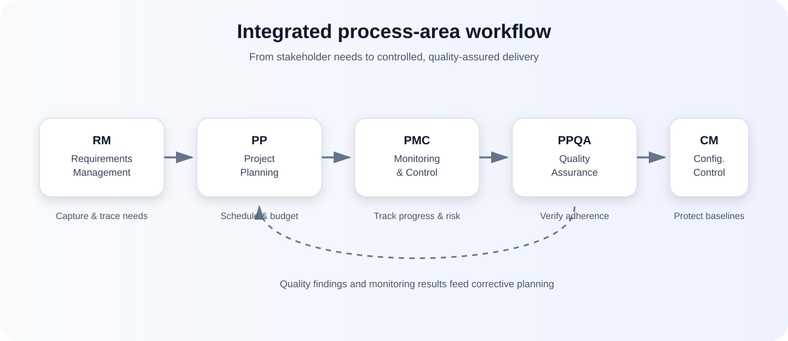
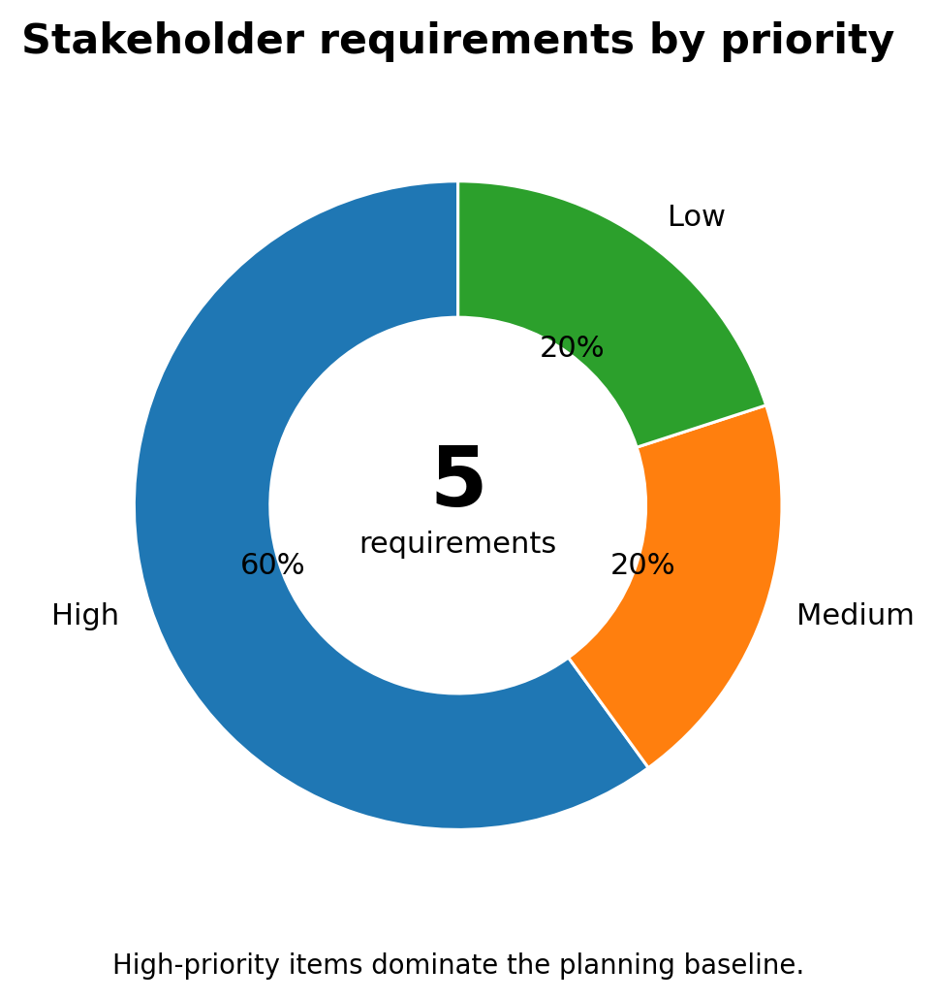
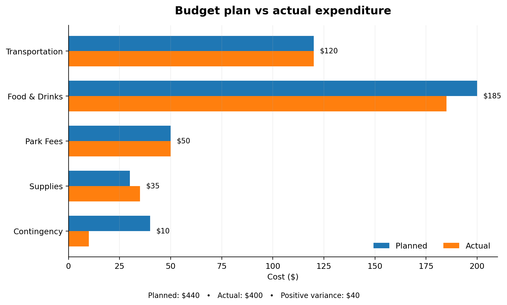
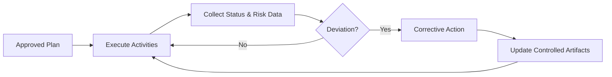
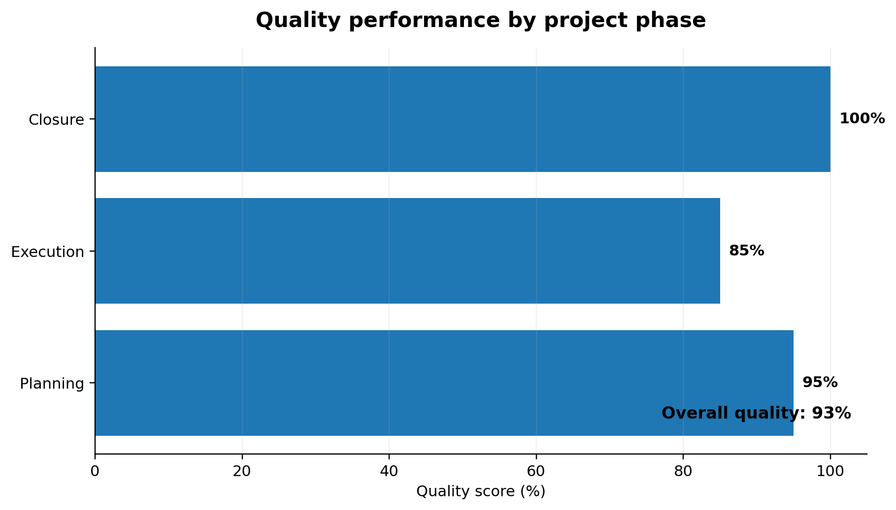
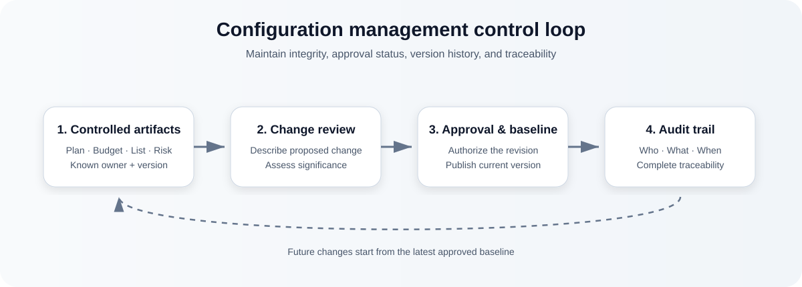
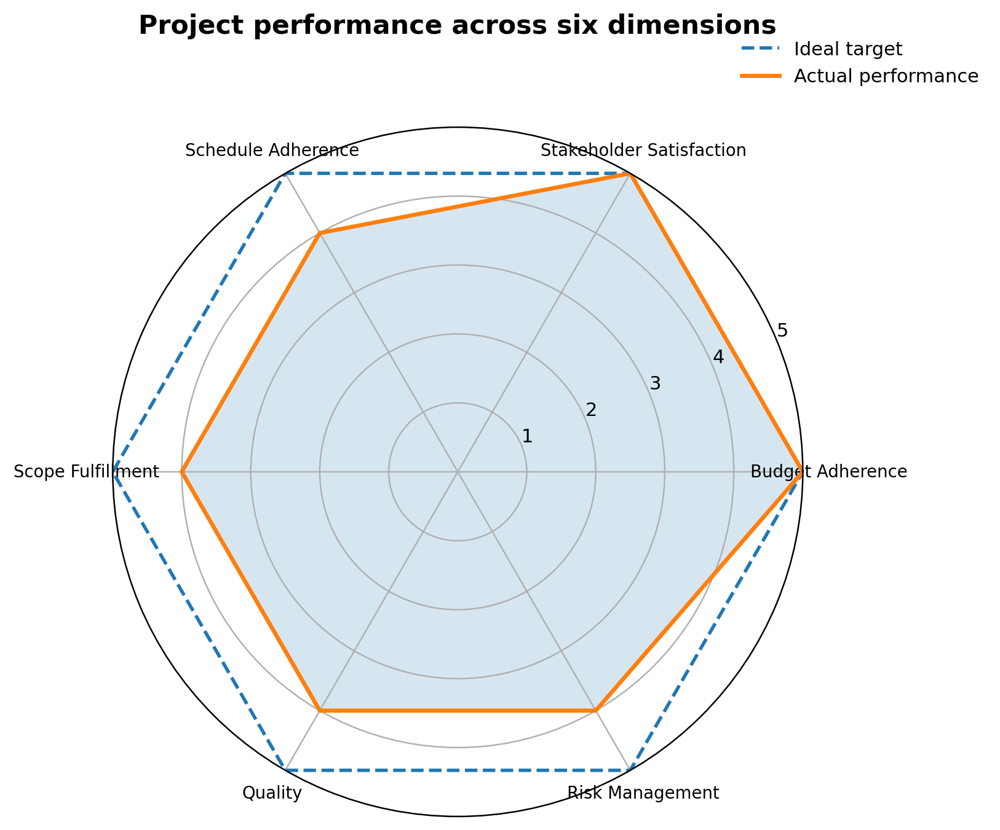

<div align="center">

# Software Process Areas — Project Case Study

### Requirements · Planning · Monitoring & Control · Quality Assurance · Configuration Management

A compact, visual case study showing how five software-process management areas can be applied to a small real-world project from requirements capture through controlled closure.


</div>

---

## Overview

This repository turns a **team hiking and picnic planning scenario** into a structured project-management case study. The objective is to organize a safe, enjoyable, well-coordinated one-day outing while staying within budget and meeting participant expectations.

The case study applies five process areas:

| Process area | Purpose in the case study | Main artifact |
|---|---|---|
| **RM — Requirements Management** | Capture, prioritize, approve, and trace stakeholder needs | Requirements Traceability Matrix |
| **PP — Project Planning** | Define activities, schedule, and budget | Schedule + Budget Plan |
| **PMC — Project Monitoring & Control** | Track performance, risks, and deviations | Status Dashboard + Risk Register |
| **PPQA — Process & Product Quality Assurance** | Verify process adherence and deliverable quality | Quality Audit Checklist |
| **CM — Configuration Management** | Maintain artifact integrity, versions, approvals, and history | Document + Change Registers |

---

## Process architecture

<p align="center">
  
</p>

The process areas are not isolated. Requirements establish the baseline, planning converts the baseline into an executable plan, monitoring detects deviations, quality assurance verifies adherence, and configuration management protects approved artifacts and their history.

---

## Case-study snapshot

| Indicator | Result |
|---|---:|
| Requirements captured | **5** |
| High-priority requirements | **60%** |
| Planned budget | **$440** |
| Actual expenditure | **$400** |
| Positive budget variance | **$40** |
| Overall quality rating | **93%** |
| Performance dimensions | **6** |

---

## 1. Requirements Management (RM)

The Requirements Traceability Matrix records stakeholder needs, their source, priority, approval state, and implementation notes. This creates a transparent audit trail from identification to final status.

<p align="center">
  
</p>

### Requirements baseline

| ID | Requirement | Source | Priority | Status |
|---|---|---|---|---|
| REQ-01 | Cost under $50 per person | Management | High | Approved |
| REQ-02 | Suitable for various fitness levels | Team Survey | High | Approved |
| REQ-03 | Include a meal (picnic-style) | Team Survey | High | Approved |
| REQ-04 | Location within 1-hour drive | Team Survey | Medium | Approved |
| REQ-05 | Dog-friendly activity | Several Members | Low | Rejected |

**Interpretation:** 3 of 5 requirements are high priority, so the plan is dominated by cost, accessibility, and meal-related constraints.

---

## 2. Project Planning (PP)

Project Planning translates the approved requirements into an actionable schedule and financial baseline. The case study tracks both planned and actual expenditure so deviations remain visible.

<p align="center">
  
</p>

### Budget summary

| Category | Planned | Actual | Variance |
|---|---:|---:|---:|
| Transportation | $120 | $120 | $0 |
| Food & Drinks | $200 | $185 | +$15 |
| Park Fees | $50 | $50 | $0 |
| Supplies | $30 | $35 | −$5 |
| Contingency | $40 | $10 | +$30 |
| **Total** | **$440** | **$400** | **+$40** |

The final result remains **under budget**, even though supplies slightly exceeded the planned amount.

---

## 3. Project Monitoring & Control (PMC)

Monitoring and control gives the team visibility into schedule, budget, attendance, and risk. Deviations are compared with the approved baseline so corrective actions can be taken before they become larger problems.

A professional control loop can be summarized as:



The case study reports positive overall control performance, including completion under budget and controlled handling of identified risks.

---

## 4. Process & Product Quality Assurance (PPQA)

Quality assurance checks whether required processes were followed and whether deliverables met the expected standard. The quality dashboard captures planning, execution, and closure performance.

<p align="center">
  
</p>

### Quality findings

| Checkpoint | Standard | Result | Finding |
|---|---|---|---|
| Requirements Review | All high-priority requirements addressed | PASS | Requirements properly tracked |
| Budget Approval | Budget ≤ $50/person | PASS | $44.44 per person achieved |
| Food Safety | Proper temperature control | **FAIL** | Potato salad discarded |
| Safety Briefing | Conducted at activity start | PASS | Documented in group chat |
| Financial Settlement | All receipts collected | PASS | Final report shared with team |

The execution-phase score is lower because of the food-safety non-conformance, while closure achieved full quality compliance.

---

## 5. Configuration Management (CM)

Configuration Management ensures that project artifacts remain controlled, current, approved, and traceable throughout the project lifecycle.

<p align="center">
  
</p>

The document register and change log answer four critical questions:

- **What** artifact is controlled?
- **Which version** is current?
- **Who** approved it?
- **When and why** did it change?

This prevents teams from working from outdated plans and provides a defensible audit trail.

---

## Integrated performance view

<p align="center">
  
</p>

The six-dimension summary shows strongest performance in **Budget Adherence** and **Stakeholder Satisfaction** (5/5), with **Schedule Adherence, Scope Fulfillment, Quality, and Risk Management** each rated 4/5.

---

## Reproduce the visualizations

```bash
python -m venv .venv
source .venv/bin/activate        # Linux/macOS
# .venv\Scripts\activate       # Windows

pip install -r requirements.txt
python scripts/generate_visuals.py
```

All chart values are stored in `data/`, so the graphics can be regenerated instead of being maintained manually.

---

## Key takeaway

The main lesson of the case study is that structured process management scales down as well as up. Even a small one-day project benefits from traceable requirements, an explicit plan, performance monitoring, independent quality checks, and controlled versions of project artifacts.

---
